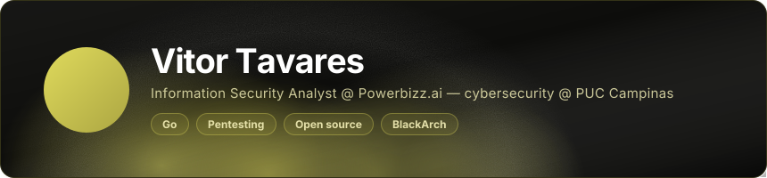
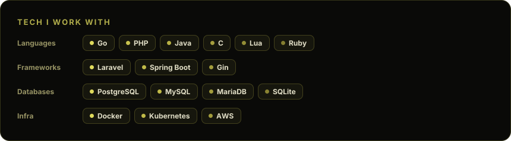

<!--
  ATENCAO: este README e GERADO. Nao edite este arquivo.
  Edite readme.source.md e rode: npx readme-aura build -g elcinco55
  Qualquer alteracao feita aqui e perdida no proximo build.
-->

Go is my main language, but I use whatever gets the job done. 
Most of what I know came from breaking something first.

